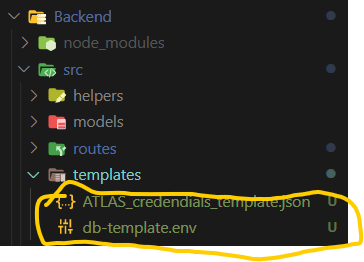
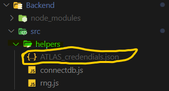
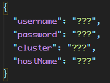
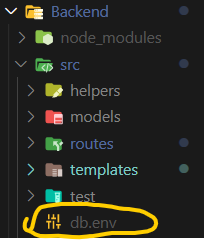
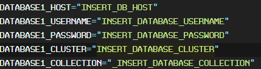

# Project CoTrace

Project CoTrace is a system created as part of an assessment in Bachelor of Information Technology to construct an application for Contact Tracing which can be applicable on a more global scale. It is based on the trust system so that people responsibly declare the places they go so that effective contract tracing can occur in our fight against the COVID-19.

## System Implementation

We have an Android Application as our end-user facing interface for people to register signup
and checkin locations

## System Architecture

Down Below is the image showing the sample architecture of the setup we made.


McCree:

> Easy.

## Database

### 0. Access Templates



### 1. Using MongoClient

After cloning the repo copy and rename the file `ATLAS_credendials_template.json` from the templates folder into the helpers folder under the name `ATLAS_credendials.json`

And fill in the `username`, `password`, `cluster` and `HostName`

 

### 2. using Mongoose

After cloning the repo copy and rename the file `db-template.env` from the templates folder into the src folder under the name `db.env`.

And replace the default values with your database credentials

 

## API Service (Node.js)

### Installation

simply

```bash
cd Backend
npm install
```

### Running

in cmd in the Backend directory

```bash
npm start
```

### Run Tests

in cmd/Terminal in the Backend directory

```bash
npm run test
```

## API Request Lists

### Add a point (GET)

```url
http://localhost:3000/map/add?pointx=888&pointy=777
```
