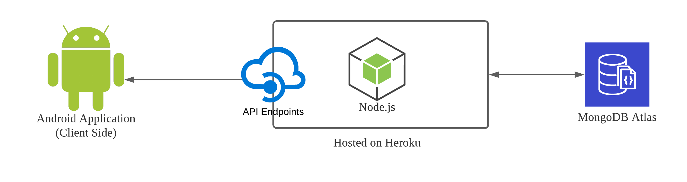

# Project CoTrace

Project CoTrace is a system created as part of an assessment in Bachelor of Information Technology to construct an application for Contact Tracing which can be applicable on a more global scale. It is based on the trust system so that people responsibly declare the places they go so that effective contract tracing can occur in our fight against the COVID-19.

## System Implementation

We have an Android Application as our end-user facing interface for people to register signup
and checkin locations

## System Architecture

Down Below is the image showing the sample architecture of the setup we made.



## Database

### 0. Access Templates


### 1. Using MongoClient (or Mongoose)

After cloning the repo copy and rename the file `ATLAS_credendials_template.json` from the templates folder into the routes folder under the name `ATLAS_credendials.json`

And fill in the `username`, `password`, `cluster` and `HostName`

 

### 2. using Mongoose

After cloning the repo copy and rename the file `db-template.env` from the templates folder into the src folder under the name `db.env`.

And replace the default values with your database credentials

 

## API Service (Node.js)

### Installation

simply

```bash
cd Backend
npm install
```

### Running

in cmd in the Backend directory

```bash
npm start
```

### Run Tests

in cmd/Terminal in the Backend directory

```bash
npm run test
```

## API Request Lists

---

### Get Heatmap points (GET)

Allows users to return the heatmap points to be projected on the google maps. The output is an array of coordinates to be placed on the map. No input parameters needed.

```url
http://localhost:3000/map/
```

### Get Locations (GET)

Gets the list of locations mapped on the data. No input parameters needed.

```url
http://localhost:3000/locations/
```

### Login Users (POST)

Allows users to login to the backend. It takes the username and password and returns a JSON Web Token for authorized users to login and gain access to the restricted services in the API.

```url
http://localhost:3000/users/login
```

```json
{
  "username": "ENTER_AUTHORIZED_USERNAME",
  "password": "ENTER_AUTHORIZED_PASSWORD"
}
```

### Signup Users (POST)

Allows users to signup to gain access to the restricted parts of the backend services. It takes fullname, username, password, phone number and returns a response message whether the user has been created or it failed.

```url
http://localhost:3000/users/signup
```

```json
{
  "name": "ENTER_FULLNAME",
  "username": "ENTER_USERNAME",
  "phNumber": "ENTER_PHONENUMBER",
  "password": "ENTER_PASSWORD"
}
```

### Checkin and Checkout Users (POST) (EXPERIMENTAL)

Allows to simulate the checkin and checkout of the user. It is in experimental phase and not yet completed. To be conducted in the upcoming sprint. It takes the authorized token in the parameters and returns a message for the timebeing until the full feature is implemented.

For Checkin

```url
http://localhost:3000/users/checkin?token=INSERT_AUTHORIZED_TOKEN
```

For Checkout

```url
http://localhost:3000/users/checkout?token=INSERT_AUTHORIZED_TOKEN
```
